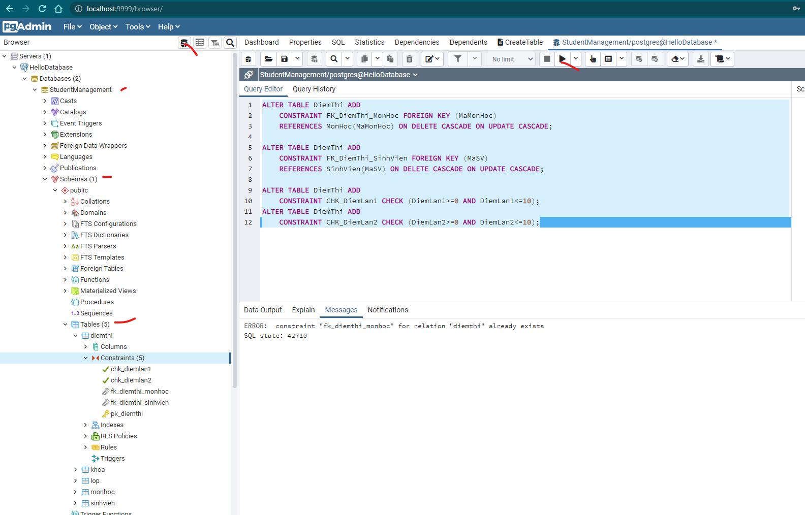

### Create table:

- Table khoa

```sh
CREATE TABLE Khoa(
	MaKhoa NCHAR(5) NOT NULL,
	TenKhoa NCHAR(50) NOT NULL,
	DienThoai NCHAR(15) NULL,
	CONSTRAINT PK_Khoa PRIMARY KEY (MaKhoa)
);
```

- Table lop

```sh
CREATE TABLE Lop(
	MaLop NCHAR(10) NOT NULL,
	TenLop NCHAR(30) NULL,
	Khoa SMALLINT NULL,
	HeDaoTao NCHAR(25) NULL,
	NamNhapHoc INT NULL,
	SiSo INT NULL,
	MaKhoa NCHAR(5) NULL,
	CONSTRAINT PK_Lop PRIMARY KEY (MaLop)
);
```

- Table SinhVien

```sh
CREATE TABLE SinhVien(
	MaSv NCHAR(10) NOT NULL,
	HoDem NCHAR(25) NOT NULL,
	Ten NCHAR(10) NOT NULL,
	NgaySinh DATE NULL,
	GioiTinh BIT NULL,
	NoiSinh NCHAR(100) NULL,
	MaLop NCHAR(10) NULL,
	CONSTRAINT PK_SinhVien PRIMARY KEY (MaSV)
);
```

- Table MonHoc

```sh
CREATE TABLE MonHoc(
	MaMonHoc NCHAR(10) NOT NULL,
	TenMonHoc NCHAR(50) NOT NULL,
	SoDVHT SMALLINT NOT NULL,
	CONSTRAINT PK_MonHoc PRIMARY KEY (MaMonHoc)
);
```

- Table DiemThi

```sh
CREATE TABLE DiemThi(
	MaMonHoc NCHAR(10) NOT NULL,
	MaSV NCHAR(10) NOT NULL,
	DiemLan1 NUMERIC(5, 2) NULL,
	DiemLan2 NUMERIC(5, 2) NULL,
	CONSTRAINT PK_DiemThi PRIMARY KEY (MaMonHoc, MaSV)
);
```

- Foreign key

```sh
ALTER TABLE Lop ADD
	CONSTRAINT FK_Lop_Khoa FOREIGN KEY (MaKhoa)
	REFERENCES Khoa(MaKhoa) ON DELETE CASCADE ON UPDATE CASCADE;
ALTER TABLE SinhVien ADD
	CONSTRAINT FK_SinhVien_Lop FOREIGN KEY (MaLop)
	REFERENCES Lop(MaLop) ON DELETE CASCADE ON UPDATE CASCADE;

ALTER TABLE DiemThi ADD
	CONSTRAINT FK_DiemThi_MonHoc FOREIGN KEY (MaMonHoc)
	REFERENCES MonHoc(MaMonHoc) ON DELETE CASCADE ON UPDATE CASCADE;

ALTER TABLE DiemThi ADD
	CONSTRAINT FK_DiemThi_SinhVien FOREIGN KEY (MaSV)
	REFERENCES SinhVien(MaSV) ON DELETE CASCADE ON UPDATE CASCADE;

ALTER TABLE DiemThi ADD
	CONSTRAINT CHK_DiemLan1 CHECK (DiemLan1>=0 AND DiemLan1<=10);
ALTER TABLE DiemThi ADD
	CONSTRAINT CHK_DiemLan2 CHECK (DiemLan2>=0 AND DiemLan2<=10);

```

- Result

[]