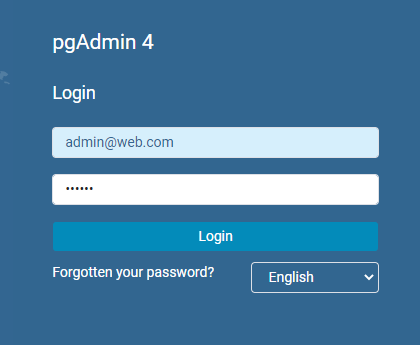
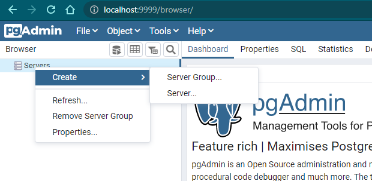
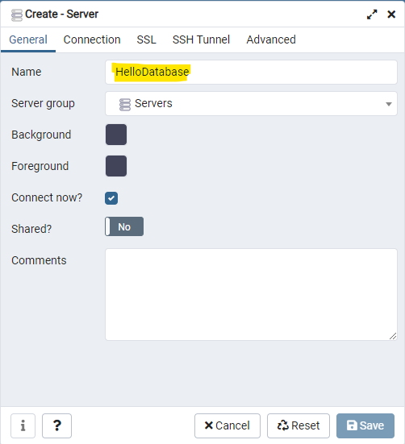
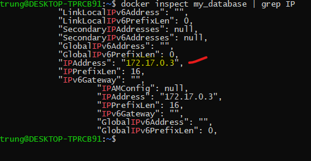
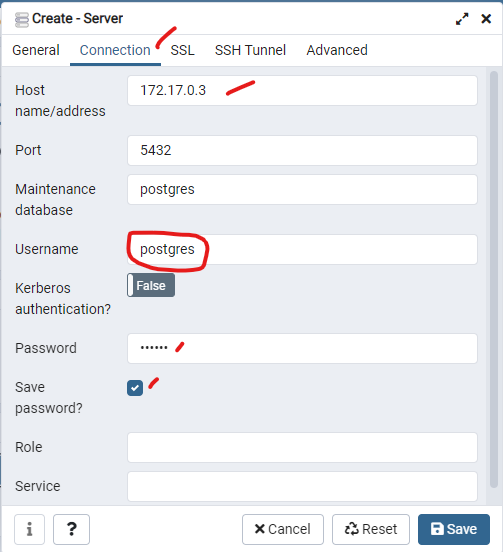

## Note:
run docker with windows Powershell on window to get permission to read/write data to shared folder

## 1. Start docker posgres
```sh
docker run -d --name my_database -p 5432:5432 -e POSTGRES_PASSWORD=abc123 -e PGDATA=/var/lib/postgresql/data/pgdata -v /mnt/d/datamac/study/web_pet/web_basic/practice_database/database:/var/lib/postgresql/data postgres
```
> default user: 'postgres'
> password of postgres: 'abc123'
> volumes to share data to host: '/mnt/d/datamac/study/web_pet/web_basic/practice_database/database'

## 2. Start pgAdmin4 to connect to Postgresql

```sh
docker run --rm -p 9999:80 -e 'PGADMIN_DEFAULT_EMAIL=admin@web.com' -e 'PGADMIN_DEFAULT_PASSWORD=123abc' -d dpage/pgadmin4
```

> port outside (at host side): 9999
> port inside docker container: 80
> email admin: 'admin@web.com'
> password admin: '123abc'

## Conect to pgAdmin
> http://localhost:9999/

[]

## Create database to learn

- Create Server

[]

- Fill information to connect to Postgresql

[]

[]

[]
